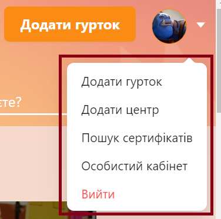
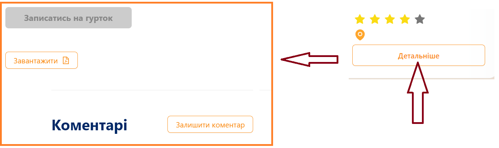
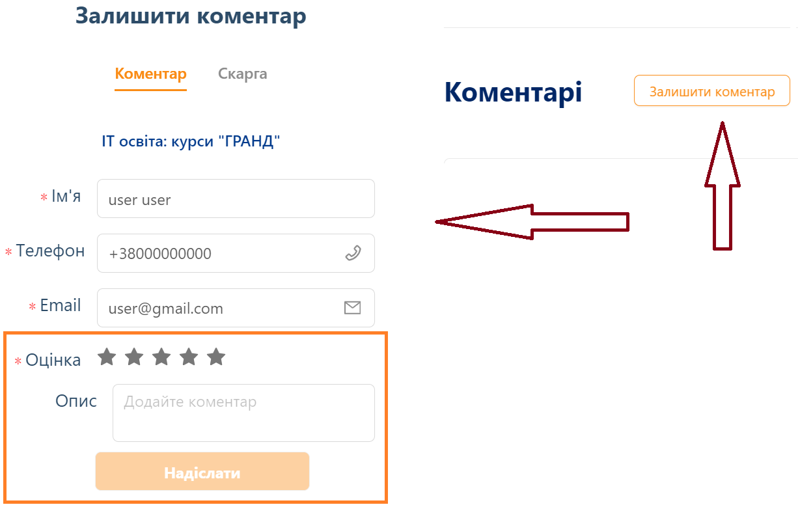
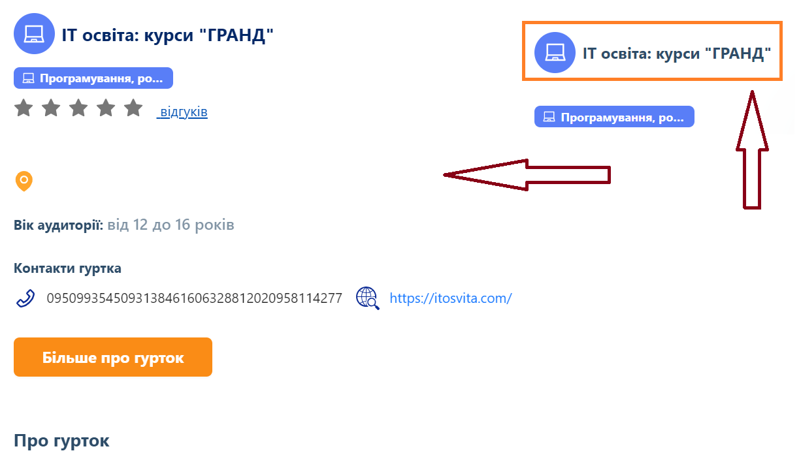

## Prerequirements
1. Familiarize yourself with the SimpleTest class. Run the tests.
2. Familiarize yourself with the com.softserve.edu.teachua package
3. Familiarize yourself with the TeachTest class. Run the tests.

## Task 1
1. Implement the LoggedDropdown class, which represents a sign-out dropdown.
   
2. Update the test method checkSuccessfulLogin() from the TeachTest class.

## Task 2
1. Implement the ClubDetailsPage class that represents the Details page.
   
2. Implement the ClubCommentModal class that allows you to add a comment.
   
3. Update the test method checkAddComment() from the TeachTest class.

## Task 3 (additional, optional)
1. Implement the ClubInfoModal class, which represents information about the club.
   
2. Update the test method checkExistComment() from the TeachTest class.

> Record a short video (3-5 minutes) demonstrating your code functionality and test execution, then post it on your YouTube channel.
The report should include a link to GitHub and a link to the video.
